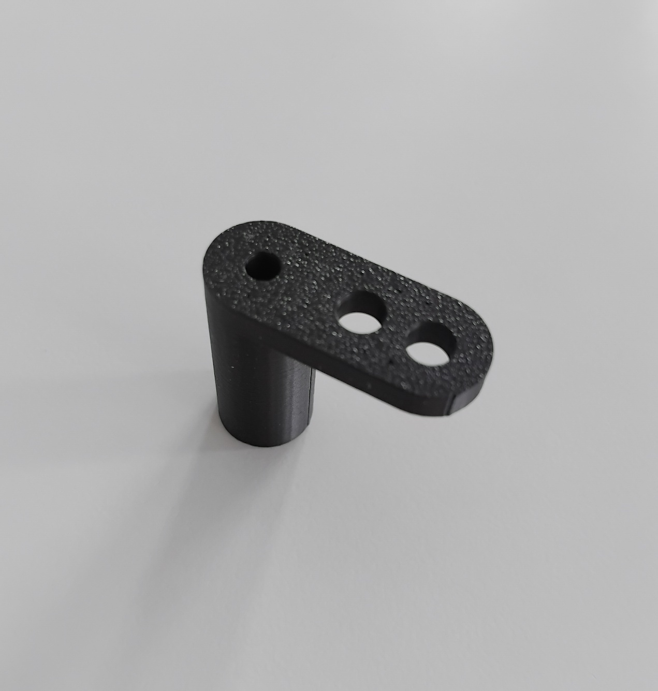
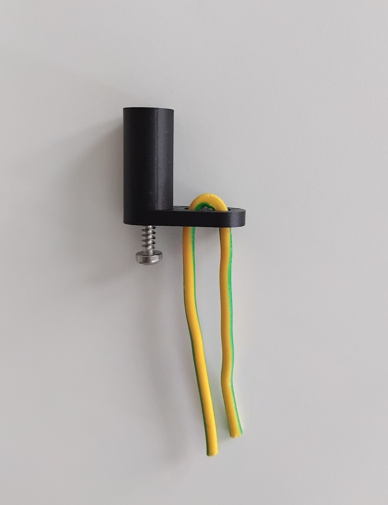
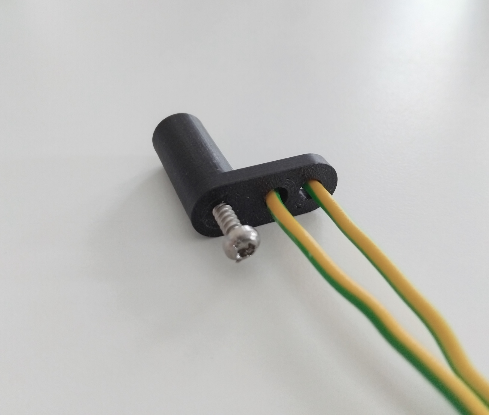
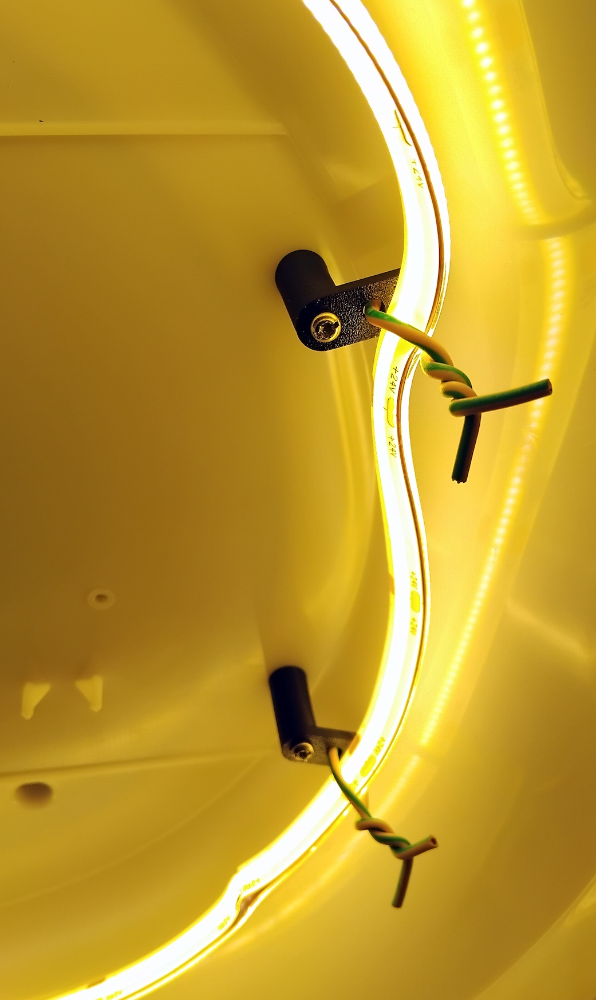
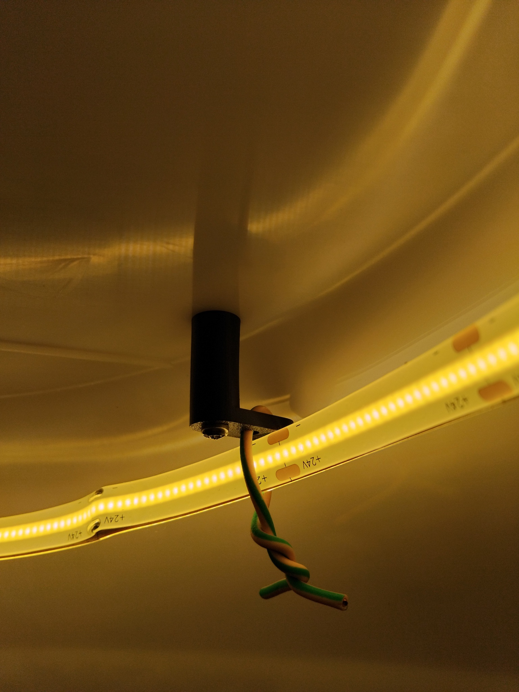
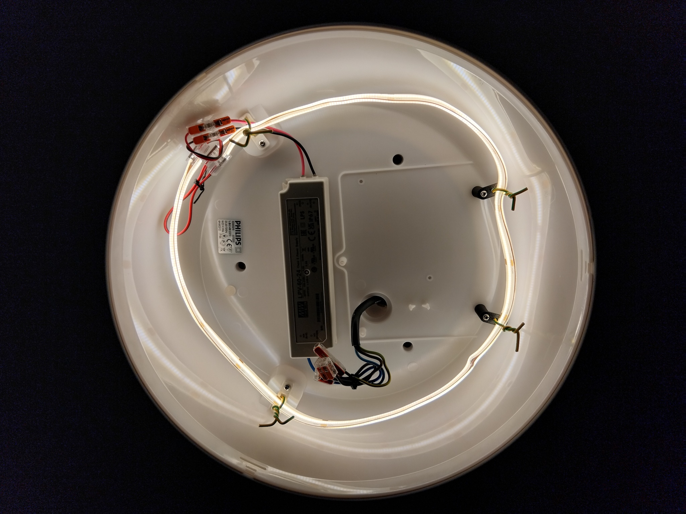

When the cirular tubes for the Philips bathroom light can no longer be ordered
after they suppossedly stop being manufactured, I searched for the new light
however liked none and also did not like the prices at all.

So, an idea came to my mind to replace the tube with a LED strip. I gutted the original power supply
and use double sided sticky tape to attach the power convertor. Both the power convertor and the LED strip
(actually 2 strips attached back to back) are water resistant.

There were two cylinders with screws left after the original power supply so I figured these can be used
to hold the LED strip. Designed the fastener in Fusion in couple of minutes, sent it to the friendly
printer in the neighborhood and this is the result. The wires are scraps after an electrician that came
for a different project, so very ecological project in the end ;-)

This is the final result:

In the end the illuminance is very similar to the tube and power consumption as well.
